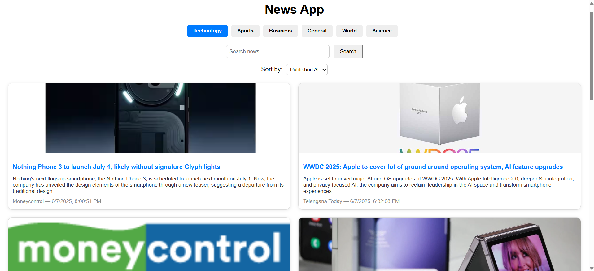

#  News Aggregator Web App

A full-stack news aggregator application that fetches and displays real-time news from the GNews API. Users can filter news by categories, search keywords, sort by date or popularity, and navigate through paginated results.

## Features

-  Keyword-based news search  
-  Category filtering (e.g., business, sports, technology, etc.)  
-  Sorting by Newest, Oldest, or Popular  
-  Pagination for browsing articles  
-  Integrated with [GNews API](https://gnews.io/)  
-  Modular backend with Spring Boot (MVC pattern)  
-  ReactJS frontend for interactive UI

---

##  Tech Stack

**Backend:**  
- Java  
- Spring Boot  
- GNews API  
- Postman (for testing)

**Frontend:**  
- ReactJS  

---
## How to Run the Project

### Frontend (ReactJS)

1. Open the `news-frontend` folder in VS Code (or any editor)
2. In the terminal, navigate to the folder:
   ```bash
   cd [path-to-frontend-folder]
   npm install
   npm run dev
3. The frontend will start on: http: //localhost:3000
4. To run frontend again just open command prompt / terminal, change directory to your frontend folder and run the "npm start" command

   note: npm install is used to install Node_modules, which is necessary for React code to run

### Backend (SpringBoot)

1. Open the `NewsApp` folder in any IDE
2. run the springboot application class

   
Note: Both the frontend and backend must be running at the same time for the application to work correctly.

Note: Make sure to paste your GNews API key in the `application.properties` file

## Screenshots

### Homepage


### Load More Button ( pagination)


### Sorting feature


### Search Field


### No Result Found


